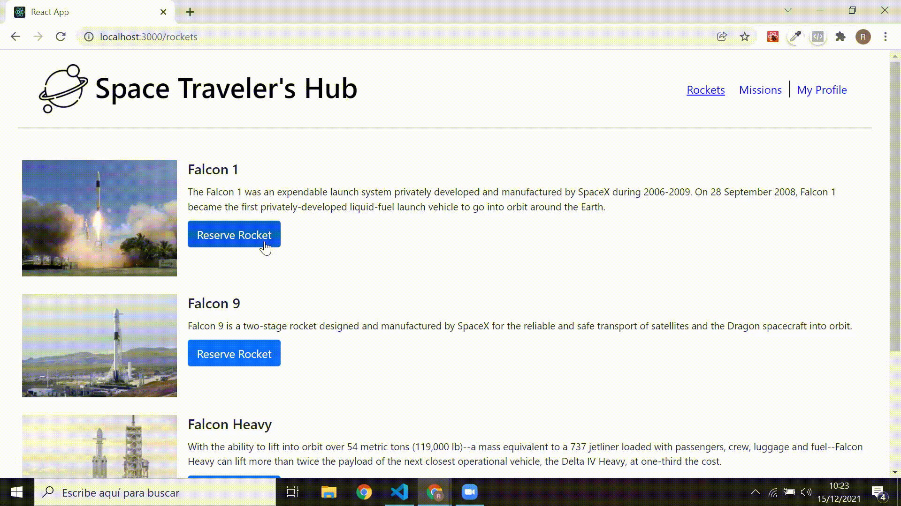

# React.js Space Travelers

> This project is in progress.

## Built With

- React js
- Redux
- Linters: Stylelint and Eslint

## Getting Started

To get a local copy up and running follow these simple example steps.

### Prerequisites

- Node js installed
- Visual Studio Code (or any other code editor)
- Terminal
- Browser of your preference

### Setup

- git clone https://github.com/RafaelEchart/React-SpaceTravelers.git
- cd React-SpaceTravelers

### Install

Inside of your directory run the following commands:

- npm install 
- npm run start

### Usage

- After ther 'npm run install' the browser will open with the React.js app

### Run tests

- Check that all the tests are correctly passed🤝

### Merge

- Merge it with your main branch so we can all see your work!!🤝

## Authors

👤 **Vanessa Aoki**

- GitHub: [@VanessaAoki](https://github.com/VanessaAoki)
- Twitter: [@VanessaSAoki](https://twitter.com/VanessaSAoki)

👤 **Rafael Echart**

- GitHub: [@rafaelechart](https://github.com/rafaelechart)
- Twitter: [@rafaechart](https://twitter.com/rafaechart)

## 🤝 Contributing

Contributions, issues, and feature requests are welcome!

## Show your support

Give a ⭐️ if you like this project!

## Acknowledgments

- Vanessa Aoki⭐️
- Rafael Echart⭐️
- Microverse documentation ⭐️

## 📝 License

This project is [MIT](./MIT.md) licensed.